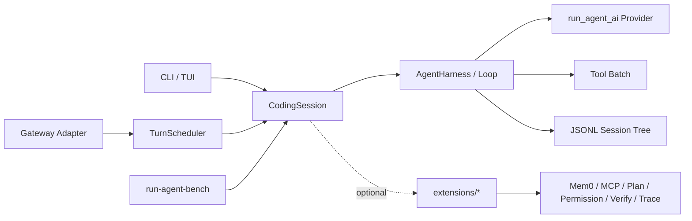

# Run Agent：本地优先的 Python Agent Harness

## 项目简介

Run Agent 是一套面向多轮复杂任务的本地优先 Agent 基础设施：按 Pi 源码的真实边界收敛为小核心、组合式 `CodingSession` 与普通文件系统扩展。核心只处理消息、模型流与工具调用；Mem0、MCP、计划模式、权限、验证与链路追踪均不硬编码进 Session，而是通过统一 `setup(api)` 契约按需加载。

平台同时提供会话级 Gateway（同会话 FIFO、跨会话并行）、物理调用账本与可离线重建的 Run Agent Bench，适合作为「Agent 运行时边界 + 可复现评测」的一体化工程实践。

## 系统架构

### 架构特点

- **单向依赖分层**：`run_agent_ai` / `run_agent_core` 不依赖 CLI/TUI；`run_agent_coding` 组合会话；Gateway、Observability、Evals 挂在上层
- **小核心 + 扩展**：默认 CodingSession 仅暴露 `read` / `write` / `edit` / `bash`；产品能力靠可安装扩展，不随 Session 自动加载
- **宿主与会话分离**：Gateway 是多会话宿主，不是单个 CodingSession 内的普通扩展；渠道通过 `setup_gateway(api)` 注册 adapter
- **可复现证据**：评测 campaign 冻结 revision、fixture digest、prompt hash、seed 与候选配置；`rebuild` 只验签归约、不调用模型
- **安全边界清晰**：项目审批控制环境输入加载，不是 OS sandbox；扩展与 adapter 以当前用户权限执行

### 核心包边界

- **Provider（`run_agent_ai`）**：OpenAI / Anthropic / Google / Mistral 等流式协议、重试、prompt cache、统一事件
- **Core（`run_agent_core`）**：消息、工具、Agent loop、Harness、JSONL session tree（无前端、无具体 provider）
- **Coding（`run_agent_coding`）**：CLI/TUI、CodingSession、上下文压缩、Skills、默认四工具、Python 扩展宿主
- **Gateway（`run_agent_gateway`）**：同会话 FIFO、跨会话并行、前后台并发隔离、持久会话池、版本化 adapter
- **Observability（`run_agent_observability`）**：逻辑调用 ↔ 物理 HTTP 尝试账本，provider / tool / turn / agent spans
- **Evals（`run_agent_evals`）**：隔离工作区、冻结 manifest、inventory 凭证、离线重建、runtime 基准、候选上线门禁
- **Extensions（`extensions/`）**：Mem0、MCP、Plan、Permission、Verification、Trace Recorder；普通 `setup(api)`，不进核心 wheel

### 请求链路



### 模块结构

```
run-agent/
├── src/
│   ├── run_agent_ai/              # Provider 传输、重试、cache、统一流事件
│   ├── run_agent_core/            # 消息 / 工具 / loop / harness / session tree
│   │   └── session/               # JSONL 持久化与分支树
│   ├── run_agent_coding/          # CLI、TUI、CodingSession、扩展宿主、Skills
│   │   ├── extensions/            # 扩展 API / loader / runtime
│   │   ├── tui/                   # Textual 交互界面
│   │   └── data/docs/             # 随包文档（架构 / CLI / 扩展 / 安全等）
│   ├── run_agent_gateway/         # 多会话调度与渠道 adapter 宿主
│   ├── run_agent_observability/   # 调用账本与 span 原语
│   └── run_agent_evals/           # Campaign、runtime bench、PromotionGate
├── extensions/                    # 正式可选扩展（不随 Session 自动加载）
│   ├── mem0/ · mcp/ · observability/
│   ├── permission_policy/ · plan_mode/ · verification/
├── examples/
│   ├── extensions/                # hello_tool / prompt_section / sidebar_status
│   └── gateway_extensions/        # 飞书长连接 / stdin JSONL adapter
├── evals/
│   └── coding/                    # 隔离任务与 verifier
├── tests/                         # pytest（asyncio）
├── Dockerfile · compose.yaml      # 飞书 Gateway 容器部署
├── study/                         # 简历表述与面试证据入口（可选）
└── pyproject.toml                 # 包元数据、入口脚本、ruff/mypy/pytest
```

## 核心功能

### 1. CodingSession 与默认工具

- **四工具默认面**：`read`（可并行）/ `write` / `edit` / `bash`（整批串行）
- **上下文预算**：token 预算触发 compaction；JSONL session tree 保存可恢复分支
- **Skills**：文件系统 Skill 检索，不绑死在核心 loop
- **无产品能力内置**：模型提供方通过配置或扩展接入，其他能力由扩展按需加载

### 2. 普通文件系统扩展

- **统一契约**：同步 `setup(api)`；失败原子回滚；reload 后旧 API generation 失效
- **官方可选集**：Mem0 记忆、MCP Streamable HTTP、Plan 只读策略、Permission 变更策略、Verification、JSONL Trace
- **安装发现**：`run-agent install` 装到 `~/.run/extensions`；项目 `.run/extensions` 需 `--project-extensions` + 审批

### 3. Gateway 多会话宿主

- **会话映射**：`channel + conversation_id` → 稳定 CodingSession
- **调度语义**：同会话 predecessor chain FIFO；跨会话前台/后台独立 semaphore 并行
- **Adapter 协议**：`setup_gateway(api)` + `messages` / `send` / `close`；setup 失败原子回滚

### 4. 可观测与成本口径

- **逻辑调用 ↔ 物理尝试**：重试、cache token、用量与费用归一化
- **Span 层**：provider / tool / turn / agent；会话 Trace 由可选 Observability 扩展注册
- **费用规则**：优先 provider 实报；否则模型目录 `catalog_estimate`；不可估价为 `null`，不写零成本

### 5. Run Agent Bench

- **真实 CodingSession campaign**：隔离工作区 + 确定性 verifier
- **证据冻结**：manifest、trial、inventory SHA-256；`rebuild` 拒收被篡改产物
- **Runtime 基准**：生产 `TurnScheduler`、Agent loop 与 `TraceRecorder`（合成工具延迟仅验证并发语义）
- **PromotionGate**：按通过率、样本数、回归与 errored trials 做候选上线硬门禁

## 技术栈

### 语言与运行时

- **Python**：3.12+
- **环境与包管理**：标准 `.venv` + pip
- **构建**：hatchling；分发包名 `run-agent-harness`

### 核心依赖

- **异步 / HTTP**：anyio、httpx（含 SOCKS）
- **模型与校验**：pydantic v2
- **CLI / TUI**：typer、rich、textual
- **配置**：python-dotenv、packaging
- **渲染**：pygments、pillow

### 工程与质量

- **格式 / Lint**：ruff
- **类型**：mypy（strict）
- **测试**：pytest、pytest-asyncio
- **入口脚本**：`run-agent`、`run-agent-gateway`、`run-agent-bench`

## 技术亮点

### 1. 边界先于功能堆叠

对照 Pi：核心 loop 只理解消息、provider 事件、工具与取消；Mem0 / MCP / Plan / Permission / Verify / Trace 全部是可卸载扩展。Gateway 因拥有多会话与全局并发额度，不作为 Session 内扩展下沉。

### 2. 同会话有序、跨会话并行

`TurnScheduler` 先按会话串行再抢 lane semaphore。本机 runtime 基准：10,000 请求全部 accepted/completed，0 丢失、0 重复、0 失败、0 会话乱序，吞吐约 21,662 requests/s（调度语义验证，不代表真实模型时延）。

### 3. 工具并发与取消收敛

纯读批有界并行并保持声明顺序；含 write/edit/bash 的批整批串行；取消时收敛全部任务。8 路固定 20 ms 合成异步读：中位耗时由约 250 ms 降至约 31 ms（−87%），顺序 0 违规。

### 4. 可离线验签的评测闭环

Campaign 冻结仓库状态与内容凭证，离线重建会校验 manifest、trial matrix、artifact path 和全部内容摘要，拒绝被修改的证据。

## 环境要求

- **Python**：3.12+
- **虚拟环境**：项目根目录下的 `.venv`
- **操作系统**：Windows / macOS / Linux（文档命令以 PowerShell 为例）
- **（可选）LLM 网关**：OpenAI-compatible 或 Anthropic-compatible
- **（可选）Mem0 / MCP**：仅在加载对应扩展时需要

## 快速开始

### 1. 安装依赖

```powershell
py -3.12 -m venv .venv
.\.venv\Scripts\python.exe -m pip install --upgrade pip
.\.venv\Scripts\python.exe -m pip install -e ".[dev,feishu]"
```

macOS / Linux 将最后两条命令中的 `.\.venv\Scripts\python.exe` 换成
`.venv/bin/python`。不使用飞书时可安装 `.[dev]`，省去飞书 SDK。

### 2. 配置环境变量

复制模板并填写密钥：

```powershell
Copy-Item .env.example .env
```

至少按需修改：

| 变量 | 说明 |
| --- | --- |
| `OPENAI_API_KEY` / `OPENAI_BASE_URL` | OpenAI-compatible 网关 |
| `MODEL` | 默认模型 ID |
| `REASONING_EFFORT` | 推理强度（如 `high`） |
| `FEISHU_APP_ID` / `FEISHU_APP_SECRET` | 飞书自建应用凭证 |
| `MEM0_API_KEY` 等 | 仅在加载 Mem0 扩展后生效 |

显式 `--model` / `--thinking` 与进程环境变量优先于 `.env`。CLI、Gateway、评测共用同一回退规则。

### 3. 启动 Coding Agent

```powershell
# 交互式 TUI
.\.venv\Scripts\run-agent.exe

# 单轮或可续接的非交互执行
.\.venv\Scripts\run-agent.exe --print "检查当前仓库并给出结论"

# JSON 事件流
.\.venv\Scripts\run-agent.exe --mode json "读取 pyproject.toml"

# 显式加载示例扩展 / 全部正式可选扩展
.\.venv\Scripts\run-agent.exe -e examples/extensions/hello_tool.py --print "调用 hello 工具"
.\.venv\Scripts\run-agent.exe -e extensions

# 会话与 provider 管理
.\.venv\Scripts\run-agent.exe sessions
.\.venv\Scripts\run-agent.exe providers
.\.venv\Scripts\run-agent.exe export <session-id>
```

安装可信扩展供后续自动发现：

```powershell
.\.venv\Scripts\run-agent.exe install extensions/mem0
.\.venv\Scripts\run-agent.exe install extensions/permission_policy
```

项目 `.run/extensions` 是可执行 Python，必须同时使用 `--project-extensions` 和项目审批。`--no-approve` 只拒绝受保护的项目输入，不是操作系统 sandbox。

### 4. Gateway（多会话入口）

Gateway 扩展须同步导出 `setup_gateway(api)` 并 `api.register_adapter(adapter)`：

```python
GATEWAY_EXTENSION_API_VERSION = 1


def setup_gateway(api):
    api.register_adapter(MyAdapter())
```

JSONL stdin/stdout 示例：

```powershell
'{"conversation_id":"demo","text":"Reply with OK"}' |
  .\.venv\Scripts\run-agent-gateway.exe `
    --extension examples/gateway_extensions/stdin_jsonl.py `
    --cwd .
```

飞书使用官方 SDK 的长连接模式，不需要公网回调地址。先在飞书开放平台创建企业
自建应用、启用机器人，授予 `im:message.p2p_msg:readonly`、
`im:message.group_at_msg:readonly`、`im:message:send_as_bot`，再在“事件与回调”中
选择长连接并订阅 `im.message.receive_v1`。发布应用并把机器人加入目标群后，配置：

```dotenv
FEISHU_APP_ID=cli_xxx
FEISHU_APP_SECRET=xxx
```

启动 Gateway：

```powershell
.\.venv\Scripts\run-agent-gateway.exe `
  --extension examples/gateway_extensions/feishu.py `
  --cwd .
```

群聊默认要求 @机器人，私聊可直接发送。完整说明见
[`examples/gateway_extensions/README.md`](examples/gateway_extensions/README.md)。
在当前聊天发送 `/new`（群聊中需 @机器人）可以新建 CodingSession；旧上下文保留在
会话存储中，Mem0 长期记忆不会被清除。

### 5. 评测与基准

```powershell
# 真实 CodingSession campaign
.\.venv\Scripts\run-agent-bench.exe run evals/coding/smoke/tasks.jsonl `
  --output-root .run/evals/my-run `
  --extension extensions/observability `
  --candidate-id baseline

.\.venv\Scripts\run-agent-bench.exe rebuild .run/evals/my-run

# 本机 runtime 基准
.\.venv\Scripts\run-agent-bench.exe runtime
.\.venv\Scripts\run-agent-bench.exe runtime-rebuild .run/benchmarks/runtime/<run-id>
```

更多约定见 [`evals/README.md`](evals/README.md)、[`extensions/README.md`](extensions/README.md)。

## 项目结构说明

### `run_agent_ai` / `run_agent_core`

- **ai**：各厂商 HTTP 流、重试与 cache；产出 provider-neutral 事件
- **core**：`AgentHarness`、loop、工具批语义、JSONL session；禁止依赖 Typer / Rich / Textual 与具体 provider 请求格式

### `run_agent_coding`

- **会话面**：系统提示、上下文窗口、Skills、会话管理与导出
- **前端**：CLI（`run-agent`）与 Textual TUI
- **扩展宿主**：API / loader / runtime；默认不注入产品专属扩展
- **信任**：项目审批控制 ambient 项目输入，不是沙箱

### `run_agent_gateway`

- **宿主职责**：持久 CodingSession 池、全局并发额度、渠道生命周期
- **调度**：会话 FIFO + 前后台 lane
- **扩展**：版本化 `setup_gateway`；示例见 `examples/gateway_extensions/`

### `run_agent_observability` / `run_agent_evals`

- **observability**：物理调用账本与通用 span；会话 `/trace` 由 `extensions/observability` 注册
- **evals**：campaign runner、evidence inventory、runtime bench、evolver / PromotionGate

### `extensions/` / `examples/` / `evals/`

- **extensions**：正式可选能力，执行权限等同当前 OS 用户
- **examples**：最小 Agent / Gateway 扩展示例
- **evals**：任务 fixtures、verifier 与验证报告

## 部署与运行建议

- 密钥只放 `.env`；`.env.example` 仅保留占位
- 需要隔离时使用 OS sandbox、容器、受限凭证与网络策略；本项目信任模型不等于沙箱
- 生产渠道 adapter 自行持有渠道凭证与 SDK 生命周期；Agent 会话与调度留在 Gateway host
- 评测产物默认落在被忽略的 `.run/`；对外分享只发布 digest 与报告摘要，避免泄漏会话内容
- 轮换 LLM / Mem0 / MCP 密钥；不要把项目扩展目录当作不可信代码自动执行源

### Docker 部署飞书 Gateway

`compose.yaml` 会把当前项目挂载到 `/workspace`，并把持久会话保存在命名卷中：

```powershell
docker compose up --build -d
docker compose logs -f run-agent-feishu
```

修改 `.env` 后重建或重启容器。停止服务使用 `docker compose down`；默认不会删除
保存会话的 `run-agent-data` 卷。

## 验证

环境参考：Windows，Python 3.12。

```powershell
.\.venv\Scripts\python.exe -m ruff format --check .
.\.venv\Scripts\python.exe -m ruff check .
.\.venv\Scripts\python.exe -m mypy
.\.venv\Scripts\python.exe -m pytest -q
.\.venv\Scripts\python.exe -m build
```

## 开发规范

- 保持包边界：新能力优先扩展或 Gateway adapter，避免塞进 `run_agent_core`
- 扩展同步 `setup(api)`；异步工作放进事件 / 工具 / 命令 handler；setup 失败必须可回滚
- Gateway 渠道实现 `messages` / `send` / `close`，不要把宿主生命周期绑到单个 Session
- 提交前执行 ruff / mypy / pytest；涉及评测语义时补确定性测试与证据路径说明
- 文档与实现同步：架构变更更新 `src/run_agent_coding/data/docs/` 与本 README

---

包边界与扩展契约以本文及 [`architecture.md`](src/run_agent_coding/data/docs/architecture.md) 为准；简历口径与指标边界可参考 [`study/resume-project.md`](study/resume-project.md)。
